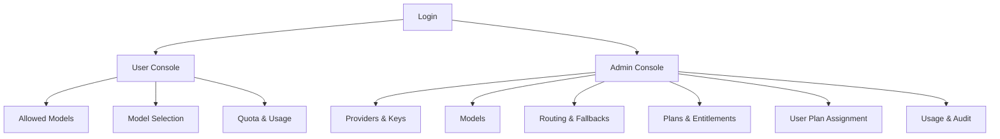

## 1. Product Overview
A database-driven AI model layer that centralizes provider/model/key configuration, routing + fallbacks, and plan-based access control.
Admins manage everything in UI; users dynamically see/select only the models their plan allows, enforced with per-model quotas.

## 2. Core Features

### 2.1 User Roles
| Role | Registration Method | Core Permissions |
|------|---------------------|------------------|
| Admin | Created/marked by operator | Manage providers/models/keys/fallbacks; define plans & entitlements; assign plans; view usage/audit; manage quotas/overrides |
| User | Email/password or SSO via Supabase Auth | View allowed models; select model for requests; view own quotas/usage |

### 2.2 Feature Module
Our requirements consist of the following main pages:
1. **Login**: authentication, session start.
2. **Admin Console**: providers/models/keys management; routing rules & fallbacks; plans & entitlements; user plan assignment; quotas/usage/audit.
3. **User Console**: allowed model list; model selection; personal quota/usage visibility.

### 2.3 Page Details
| Page Name | Module Name | Feature description |
|-----------|-------------|---------------------|
| Login | Auth | Sign in/out using Supabase Auth; route by role (admin vs user). |
| Admin Console | Provider Management | Create/edit/disable providers (e.g., OpenAI, Anthropic); store provider metadata (name, base URL, notes). |
| Admin Console | API Key Vault | Add/rotate/disable provider API keys; tag keys (environment, region); set key priority and health state. |
| Admin Console | Model Catalog | Create/edit models (internal “model_id”, display name, modality); map models to provider-specific model names; set model status (active/deprecated). |
| Admin Console | Routing & Fallbacks | Define per-model routing policy: primary provider/key selection rule and ordered fallback chain; set retry conditions (timeout/5xx/rate_limit) and max attempts. |
| Admin Console | Plans & Entitlements | Create plans; define which models each plan can access; configure per-model quotas per plan (requests and/or token budget per period). |
| Admin Console | User Plan Assignment | Assign a plan to a user; optional per-user overrides (enable/disable a model, custom quota). |
| Admin Console | Usage & Audit | View usage aggregated by plan/user/model/provider; see quota consumption and recent usage events; view configuration change audit log. |
| User Console | Allowed Models | List models enabled for the user (by plan + overrides); show key metadata (context window label, cost tier label, status). |
| User Console | Model Selection | Select an allowed model to use (returns/sets current model_id); show warnings when near quota. |
| User Console | Quota & Usage | Display remaining quota per model and reset time; show recent usage history (last N requests). |

## 3. Core Process
**Admin Flow**
1. Admin logs in and opens Admin Console.
2. Admin creates providers and enters API keys (can keep multiple keys per provider).
3. Admin defines internal models and maps them to provider-specific model names.
4. Admin configures routing for each model (primary + fallbacks).
5. Admin creates plans and enables specific models with per-model quotas.
6. Admin assigns plans to users (optionally with per-user overrides).
7. Admin monitors usage, quota consumption, and audits configuration changes.

**User Flow**
1. User logs in and opens User Console.
2. User sees only models allowed by their plan and selects one (model_id).
3. When the product calls the model layer, the system enforces plan entitlement + quota, routes to provider/key, and falls back on failures.
4. User views remaining quota and recent usage.

