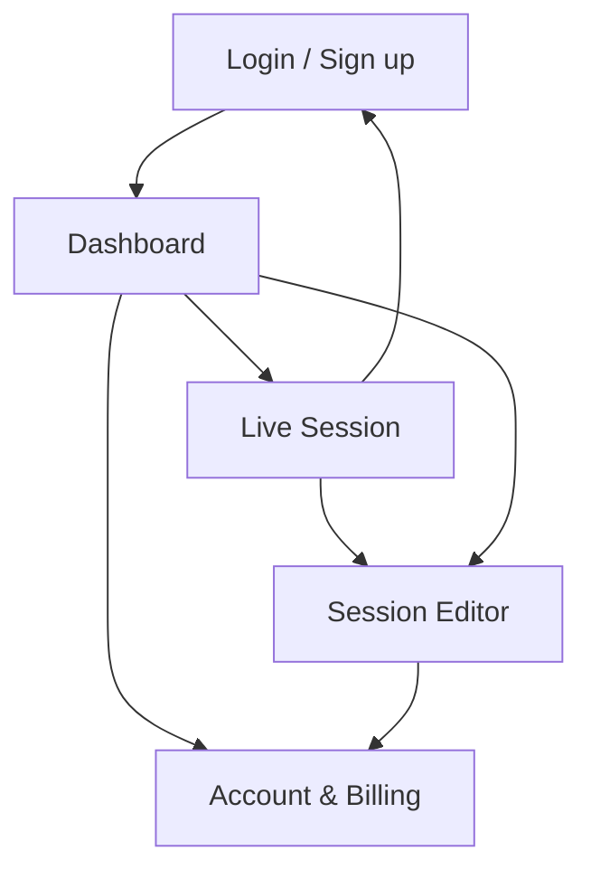

## 1. Product Overview
A desktop-first redesign of live.maestra.ai into an extremely minimal, intuitive real-time transcription + translation experience.
The UI prioritizes “Start a live session fast”, then progressively reveals advanced tools (saving, exporting, voice output, integrations).

## 2. Core Features

### 2.1 User Roles
| Role | Registration Method | Core Permissions |
|------|---------------------|------------------|
| Guest | No account (instant start) | Start a live session, view live captions/translations, share viewer link/QR (read-only viewers) |
| Signed-in User | Email/SSO login | Save sessions to Dashboard, edit saved text/captions, export formats, manage vocabulary/diarization options |
| Team Admin (optional) | Create/join team workspace | Invite members, access shared sessions, manage team settings and billing |

### 2.2 Feature Module
Our redesign consists of the following main pages:
1. **Live Session**: start/capture controls, live transcript/captions, live translation, share link/QR, session settings.
2. **Dashboard**: saved sessions list, search/filter, create new live session, basic status and quick actions.
3. **Session Editor**: transcript editor, subtitle view/styling, speaker/diarization review, voice output/voiceover setup, export panel.
4. **Account & Billing**: plan status, usage, invoices, integrations toggles, team management.
5. **Login / Sign up**: authentication and upgrade entry.

### 2.3 Page Details
| Page Name | Module Name | Feature description |
|---|---|---|
| Live Session | Primary CTA + capture setup | Start session in 1 click; choose source/target language; optionally enable auto-detect and audio source selection. |
| Live Session | Live canvas | Display live transcript and (optional) translated line in a clean, high-contrast stream; support pause/resume and “clear view” mode. |
| Live Session | Share | Generate viewer link and QR; provide “viewer mode” that hides controls and focuses on readability. |
| Live Session | Session controls | Toggle voice output, diarization, and custom vocabulary; show only the few most-used toggles, place the rest under “More”. |
| Live Session | Save/upgrade | Prompt to sign in or upgrade when trying to save/export; allow seamless continuation of the running session. |
| Dashboard | Library | List saved sessions with title, date, language pair, duration; enable search + quick filters (type/status). |
| Dashboard | Quick actions | Create new live session; open last session; delete/rename. |
| Session Editor | Text editing | Edit transcript with timestamps; support find/replace; keep edits non-destructive with basic revision history. |
| Session Editor | Subtitle / caption editor | Convert transcript to captions; adjust segmentation; preview readable caption blocks. |
| Session Editor | Audio/voice features | Configure voice output/voiceover; preview; choose voice options if available. |
| Session Editor | Export | Export transcript/captions/voiceover in supported formats; show a single export entrypoint with presets. |
| Account & Billing | Plan + usage | Show plan, limits, and usage; guide upgrades with transparent value and minimal friction. |
| Account & Billing | Team (optional) | Manage members/roles; view shared sessions; control access. |
| Login / Sign up | Auth | Sign in/up; continue to last attempted action (save/export) after successful auth. |

## 3. Core Process
Guest Flow:
- Open Live Session page → choose language pair (or auto-detect) → start capture → optionally share viewer link/QR → if user tries to save/export, prompt login/upgrade while keeping session running.

Signed-in User Flow:
- Start Live Session → save session to Dashboard → open Session Editor → clean transcript/captions → export desired outputs → manage plan/usage in Account.

Team Admin Flow (optional):
- Sign in → create team → invite members → share saved sessions → manage billing and team settings.

