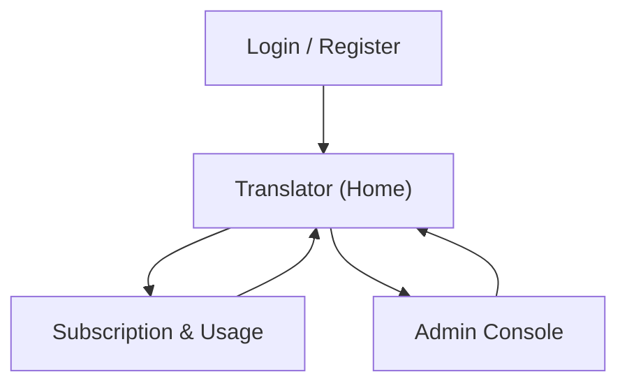

## 1. Product Overview
Add two cross-cutting capabilities to the app: an app-wide loading activity indicator and subscription tiers with monthly usage limits.
This enables clear user feedback during page/data loads and enforces fair, plan-based translation usage with admin oversight.

## 2. Core Features

### 2.1 User Roles
| Role | Registration Method | Core Permissions |
|------|---------------------|------------------|
| User | Email/OAuth sign-in | Can translate within monthly limit, view usage, view available tiers |
| Admin | Admin flag assigned internally | Can configure tiers/limits, assign user tiers, view metering/usage, export usage logs |

### 2.2 Feature Module
Our requirements consist of the following main pages:
1. **Translator (Home)**: translation input/output, global loading indicator behavior during requests, limit messaging.
2. **Subscription & Usage**: tier list, current tier, monthly usage consumed/remaining, limit reset date.
3. **Admin Console**: manage tiers/limits, manage user subscriptions, usage monitoring and audit.
4. **Login / Register**: authenticate users.

### 2.3 Page Details
| Page Name | Module Name | Feature description |
|-----------|-------------|---------------------|
| Translator (Home) | Global loading indicator | Show app-wide loading state during route transitions and data loads; show contextual spinner/skeletons for translation requests; prevent double-submit while loading. |
| Translator (Home) | Translation request + metering | Submit translation request; record usage (at minimum: request count; optionally: character count) per user per month; show request status (success/error). |
| Translator (Home) | Monthly limit enforcement | Block translation when limit is exhausted; display remaining quota and reset date; provide link to Subscription & Usage page. |
| Subscription & Usage | Tier catalog | Display available tiers and their monthly usage limits; highlight current tier. |
| Subscription & Usage | Usage summary | Display current month usage consumed/remaining; show metering unit (requests and/or characters) and last updated timestamp. |
| Subscription & Usage | Upgrade/Change request | Initiate a tier change request flow (at minimum: user submits request; admin approves/applies). |
| Admin Console | Tier management | Create/update tiers and monthly limits; activate/deactivate tiers; define metering unit (requests and/or characters). |
| Admin Console | User subscription management | Search users; assign/change tier; set per-user override limit; set subscription effective date; optionally reset current month usage. |
| Admin Console | Usage monitoring | View per-user usage for current month; filter by tier/date range; export usage logs. |
| Admin Console | Audit log | Record admin actions (tier edits, user tier changes, overrides, resets) with timestamp and actor. |
| Login / Register | Authentication | Sign in/sign up/sign out; redirect back to intended page after login. |
| All pages | Page/data load handling | Use a consistent global loading pattern for initial app boot, route changes, and key data fetches; show friendly retry message on failures. |

## 3. Core Process
**User flow (translation + limits)**
1. You sign in.
2. You open the Translator page; the app shows a global loading indicator during initial data load.
3. You submit a translation; the UI shows a request-level spinner and disables the submit button.
4. The system meters the request and checks your remaining monthly limit.
5. If within limit, you receive the translation result and your usage summary updates.
6. If limit is exceeded, the request is blocked and you are guided to Subscription & Usage.

**User flow (subscription visibility / change request)**
1. You open Subscription & Usage.
2. You view your current tier and remaining monthly usage.
3. You submit a tier change request (if applicable); the system shows a confirmation state.

**Admin flow (tiers, assignments, monitoring)**
1. You open Admin Console.
2. You adjust tier limits or create a new tier.
3. You search a user and assign/change their tier or set an override.
4. You monitor usage and export logs; key actions are written to the audit log.

