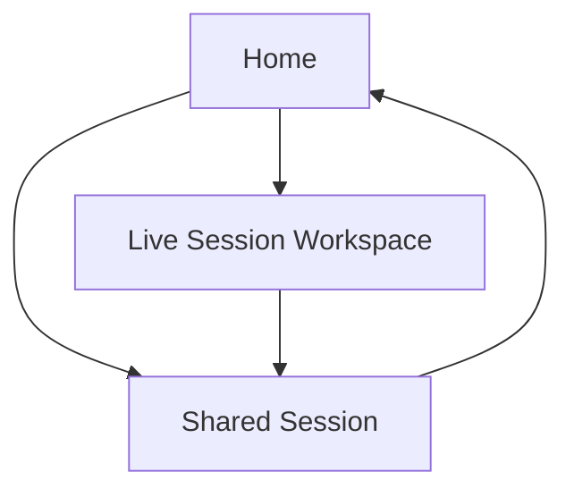

## 1. Product Overview
An in-browser app for real-time speech transcription and translation with minimal perceived latency.
It supports multi-speaker conversations, sharable session links, editable session history, and exports.

## 2. Core Features

### 2.1 User Roles
| Role | Registration Method | Core Permissions |
|------|---------------------|------------------|
| Guest | No sign-up | Create ad-hoc sessions, transcribe/translate, export locally, share link (limited) |
| Signed-in User | Email + password or magic link | Cloud session storage, edit history, manage sharing links, export, revoke links |

### 2.2 Feature Module
Our requirements consist of the following main pages:
1. **Home**: start/join session, device checks, language setup, sign-in.
2. **Live Session Workspace**: real-time transcript + translation, speaker attribution, editing, sharing, exports.
3. **Shared Session**: read-only playback of transcript/translation, download exports, request access (if restricted).

### 2.3 Page Details
| Page Name | Module Name | Feature description |
|-----------|-------------|---------------------|
| Home | Start / Join | Create a new session or open an existing session by ID/link. |
| Home | Device + Permission Check | Detect microphone availability, show permission prompts, and provide a short test meter. |
| Home | Language Setup | Select input language (spoken), target translation language(s), and transcription mode (verbatim/clean). |
| Home | Auth | Sign in/sign up/sign out to enable cloud storage and link management. |
| Home | Recent Sessions | List your recent sessions with last edited time; open or delete (signed-in only). |
| Live Session Workspace | Capture & Streaming | Start/stop/pause capture; stream audio with low buffering; show connection/latency status. |
| Live Session Workspace | Real-time Transcript | Render incremental partial results and confirmed segments; auto-scroll with manual override. |
| Live Session Workspace | Translation Panel | Display near-real-time translation per segment; allow toggling languages and show “translating…” states. |
| Live Session Workspace | Multi-speaker Support | Assign speaker labels to segments; allow merge/split segments and relabel speakers. |
| Live Session Workspace | Editing | Edit transcript and translation text; track “edited” state per segment and keep original text accessible. |
| Live Session Workspace | Session Metadata | Set session title, notes, languages, and visibility; show participants (optional). |
| Live Session Workspace | Sharing Links | Generate a shareable link with access level (public read-only / unlisted / restricted); revoke/regenerate. |
| Live Session Workspace | Export | Export transcript/translation to TXT, SRT, VTT, and JSON; choose include speakers/timestamps. |
| Live Session Workspace | Session Persistence | Auto-save segments and edits; restore session state on refresh; handle offline/rehydration gracefully. |
| Shared Session | View | Display read-only transcript + translation with speaker labels and timestamps. |
| Shared Session | Export / Download | Download permitted export formats; show watermark/notice if restricted. |
| Shared Session | Access Control UX | If restricted, prompt to sign in and request access (or show “no access”). |

## 3. Core Process
**Guest Flow**: Open Home → allow mic → choose languages → start session → see live transcript + translation → optionally label speakers → export locally → create share link (public/unlisted if allowed).

**Signed-in Flow**: Sign in on Home → create session → live transcribe/translate → edit segments and speaker labels → auto-saves to cloud → generate/revoke share links → export and/or share read-only view.

