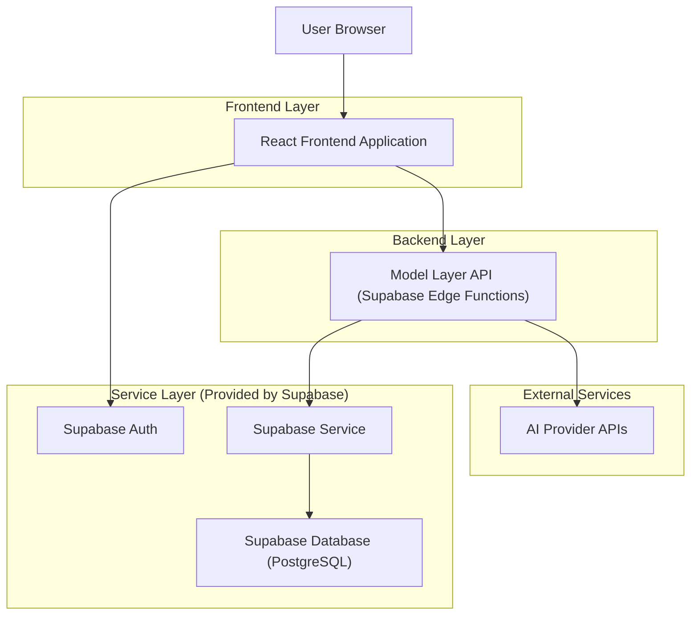
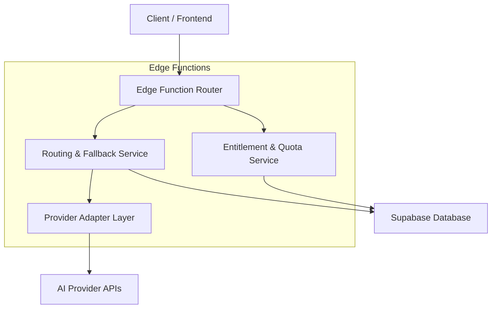
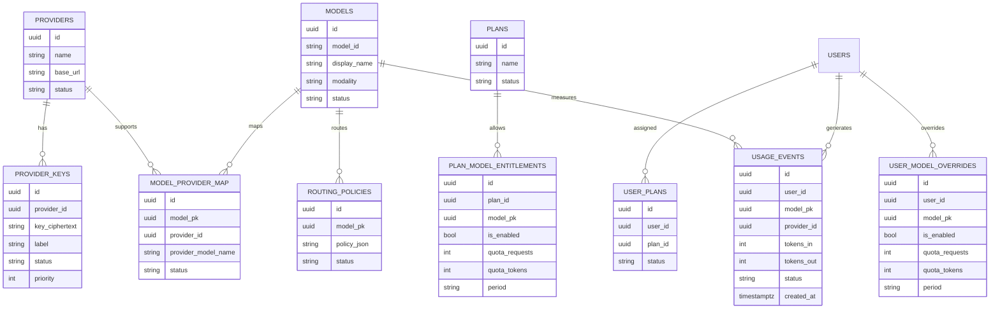

## 1.Architecture design


## 2.Technology Description
- Frontend: React@18 + tailwindcss@3 + vite
- Backend: Supabase Edge Functions (TypeScript) + Supabase Auth
- Database: Supabase (PostgreSQL)

## 3.Route definitions
| Route | Purpose |
|-------|---------|
| /login | Authenticate and establish session |
| /admin | Admin console for configuration (providers, models, plans, quotas, usage) |
| /app | User console for allowed models, selection, and usage/quota |

## 4.API definitions (If it includes backend services)
### 4.1 Shared TypeScript types
```ts
type UUID = string;

type Provider = {
  id: UUID;
  name: string;
  base_url?: string;
  status: "active" | "disabled";
};

type Model = {
  id: UUID;
  model_id: string; // internal stable identifier used by clients
  display_name: string;
  modality: "text" | "image" | "audio" | "multimodal";
  status: "active" | "deprecated" | "disabled";
};

type PlanModelEntitlement = {
  plan_id: UUID;
  model_id: UUID;
  is_enabled: boolean;
  quota_requests_per_period?: number;
  quota_tokens_per_period?: number;
  period: "day" | "month";
};

type AllowedModel = {
  model_id: string; // internal stable identifier
  display_name: string;
  remaining_requests?: number;
  remaining_tokens?: number;
  resets_at: string; // ISO
};
```

### 4.2 Core API
**List allowed models for current user**
```
GET /api/models/allowed
```
Response: `AllowedModel[]`

**Create a model request (proxy + enforcement)**
```
POST /api/model-request
```
Request:
| Param Name | Param Type | isRequired | Description |
|-----------|------------|-----------|-------------|
| model_id | string | true | Internal model id selected by user |
| input | object | true | Provider-agnostic payload (e.g., messages) |
| mode | string | true | E.g., "chat_completions" |

Response:
| Param Name | Param Type | Description |
|-----------|-------------|-------------|
| output | object | Provider-agnostic response |
| provider | string | Provider used after routing |
| used_fallback | boolean | Whether a fallback path was taken |

**Admin: CRUD configuration (role-gated)**
```
POST/PUT/DELETE /api/admin/providers
POST/PUT/DELETE /api/admin/provider-keys
POST/PUT/DELETE /api/admin/models
POST/PUT/DELETE /api/admin/routing-policies
POST/PUT/DELETE /api/admin/plans
POST/PUT/DELETE /api/admin/plan-entitlements
POST/PUT /api/admin/user-plan
GET /api/admin/usage
GET /api/admin/audit
```

## 5.Server architecture diagram (If it includes backend services)


## 6.Data model(if applicable)
### 6.1 Data model definition


### 6.2 Data Definition Language
```sql
CREATE TABLE providers (
  id uuid PRIMARY KEY DEFAULT gen_random_uuid(),
  name text NOT NULL,
  base_url text,
  status text NOT NULL DEFAULT 'active',
  created_at timestamptz DEFAULT now()
);

CREATE TABLE models (
  id uuid PRIMARY KEY DEFAULT gen_random_uuid(),
  model_id text UNIQUE NOT NULL,
  display_name text NOT NULL,
  modality text NOT NULL,
  status text NOT NULL DEFAULT 'active',
  created_at timestamptz DEFAULT now()
);

CREATE TABLE plans (
  id uuid PRIMARY KEY DEFAULT gen_random_uuid(),
  name text UNIQUE NOT NULL,
  status text NOT NULL DEFAULT 'active',
  created_at timestamptz DEFAULT now()
);

CREATE TABLE plan_model_entitlements (
  id uuid PRIMARY KEY DEFAULT gen_random_uuid(),
  plan_id uuid NOT NULL,
  model_pk uuid NOT NULL,
  is_enabled boolean NOT NULL DEFAULT true,
  quota_requests int,
  quota_tokens int,
  period text NOT NULL DEFAULT 'month'
);

CREATE TABLE user_plans (
  id uuid PRIMARY KEY DEFAULT gen_random_uuid(),
  user_id uuid NOT NULL,
  plan_id uuid NOT NULL,
  status text NOT NULL DEFAULT 'active'
);

CREATE TABLE usage_events (
  id uuid PRIMARY KEY DEFAULT gen_random_uuid(),
  user_id uuid NOT NULL,
  model_pk uuid NOT NULL,
  provider_id uuid,
  tokens_in int DEFAULT 0,
  tokens_out int DEFAULT 0,
  status text NOT NULL,
  created_at timestamptz DEFAULT now()
);

-- Typical grants (adjust per RLS strategy)
GRANT SELECT ON providers, models, plans TO anon;
GRANT ALL PRIVILEGES ON providers, models, plans, plan_model_entitlements, user_plans, usage_events TO authenticated;
```