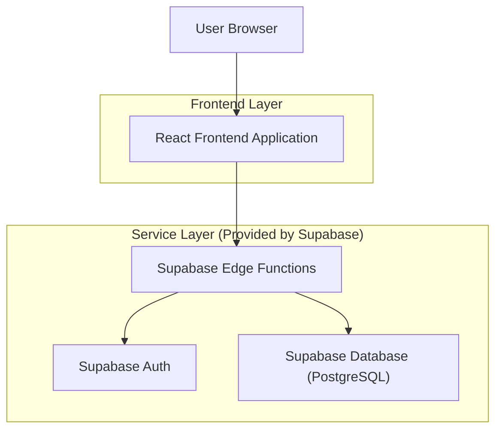
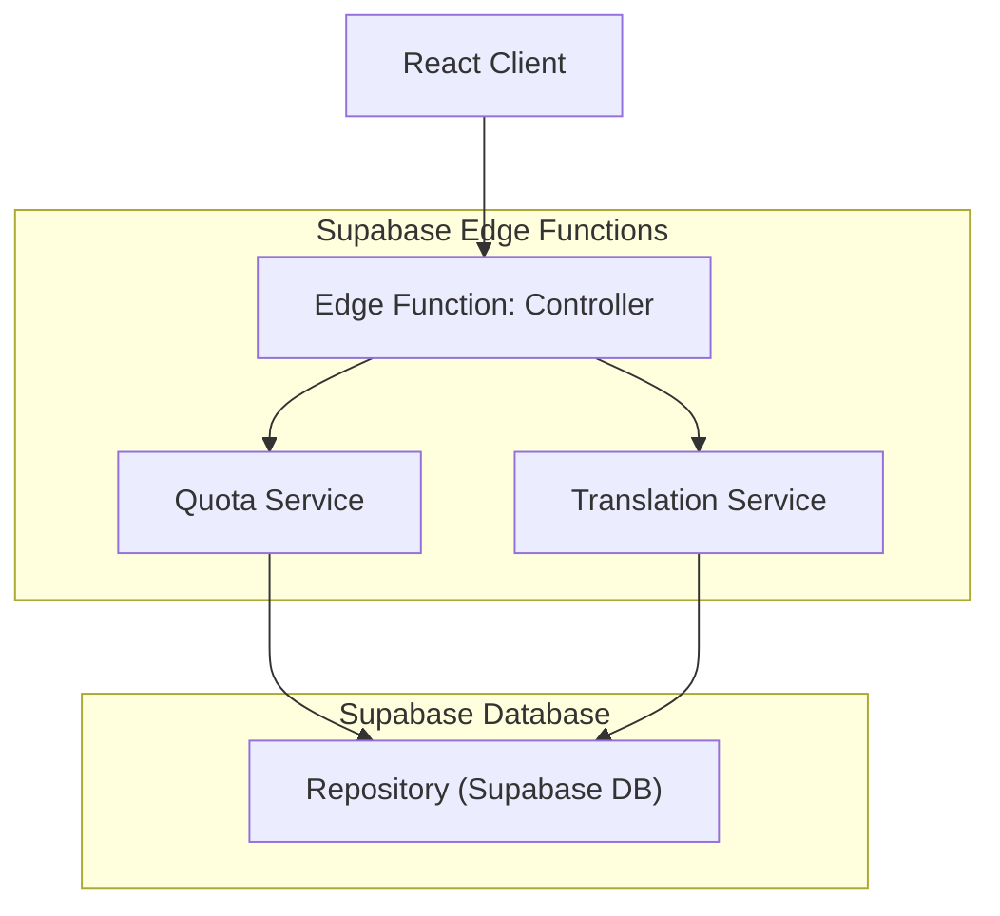
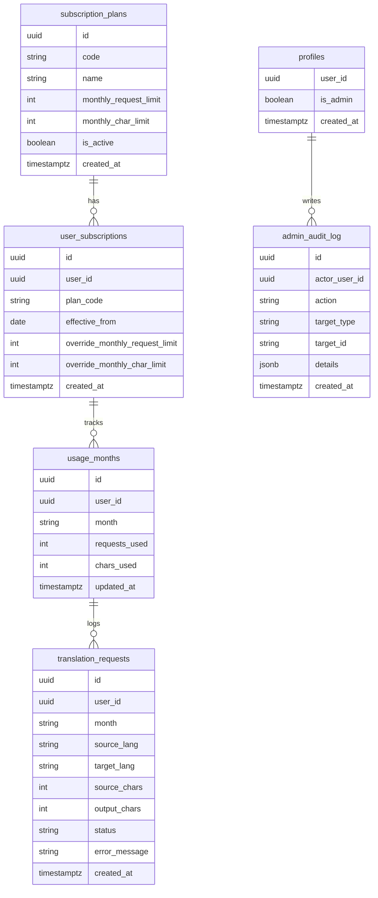

## 1.Architecture design


## 2.Technology Description
- Frontend: React@18 + TypeScript + vite + tailwindcss@3
- Backend: Supabase (Auth + PostgreSQL + Edge Functions)

## 3.Route definitions
| Route | Purpose |
|-------|---------|
| / | Translator home; submit translation; show global loading patterns |
| /usage | Subscription & Usage; show tier and monthly usage |
| /admin | Admin console; manage tiers, user subscriptions, and usage monitoring |
| /login | Login/register and session bootstrap |

## 4.API definitions (If it includes backend services)
### 4.1 Core API
Translation + metering (secure, server-enforced)
```
POST /functions/v1/translate
```
Request:
| Param Name| Param Type | isRequired | Description |
|---|---|---|---|
| sourceText | string | true | Text to translate |
| sourceLang | string | true | Source language code |
| targetLang | string | true | Target language code |

Response:
| Param Name| Param Type | Description |
|---|---|---|
| translatedText | string | Translated output |
| meter | { requestsUsed:number; charsUsed:number; month:string } | Usage applied for this call |
| remaining | { requestsRemaining:number; charsRemaining:number } | Remaining quota (if applicable) |

Usage summary
```
GET /functions/v1/usage
```
Response returns current plan, current month usage, and reset date.

Admin: manage plans and assignments
```
POST /functions/v1/admin/plans/upsert
POST /functions/v1/admin/users/set-subscription
GET  /functions/v1/admin/usage
```

### 4.2 Shared TypeScript types
```ts
export type Plan = {
  id: string;
  code: string; // e.g., "free", "pro"
  name: string;
  monthly_request_limit: number;
  monthly_char_limit: number; // 0 if unused
  is_active: boolean;
};

export type UserSubscription = {
  user_id: string;
  plan_code: string;
  effective_from: string; // ISO date
  override_monthly_request_limit?: number;
  override_monthly_char_limit?: number;
};

export type UsageMonth = {
  user_id: string;
  month: string; // YYYY-MM
  requests_used: number;
  chars_used: number;
  updated_at: string;
};

export type TranslationRequestLog = {
  id: string;
  user_id: string;
  created_at: string;
  source_lang: string;
  target_lang: string;
  source_chars: number;
  output_chars: number;
  status: "success" | "rejected_limit" | "error";
};
```

## 5.Server architecture diagram (If it includes backend services)


## 6.Data model(if applicable)

### 6.1 Data model definition


### 6.2 Data Definition Language
Subscription plans
```sql
CREATE TABLE subscription_plans (
  id UUID PRIMARY KEY DEFAULT gen_random_uuid(),
  code TEXT UNIQUE NOT NULL,
  name TEXT NOT NULL,
  monthly_request_limit INTEGER NOT NULL DEFAULT 0,
  monthly_char_limit INTEGER NOT NULL DEFAULT 0,
  is_active BOOLEAN NOT NULL DEFAULT TRUE,
  created_at TIMESTAMPTZ NOT NULL DEFAULT NOW()
);

-- Basic access pattern
GRANT SELECT ON subscription_plans TO anon;
GRANT ALL PRIVILEGES ON subscription_plans TO authenticated;
```
User subscriptions
```sql
CREATE TABLE user_subscriptions (
  id UUID PRIMARY KEY DEFAULT gen_random_uuid(),
  user_id UUID NOT NULL,
  plan_code TEXT NOT NULL,
  effective_from DATE NOT NULL DEFAULT CURRENT_DATE,
  override_monthly_request_limit INTEGER,
  override_monthly_char_limit INTEGER,
  created_at TIMESTAMPTZ NOT NULL DEFAULT NOW()
);

CREATE INDEX idx_user_subscriptions_user_id ON user_subscriptions(user_id);
GRANT ALL PRIVILEGES ON user_subscriptions TO authenticated;
```
Usage + logs
```sql
CREATE TABLE usage_months (
  id UUID PRIMARY KEY DEFAULT gen_random_uuid(),
  user_id UUID NOT NULL,
  month TEXT NOT NULL,
  requests_used INTEGER NOT NULL DEFAULT 0,
  chars_used INTEGER NOT NULL DEFAULT 0,
  updated_at TIMESTAMPTZ NOT NULL DEFAULT NOW(),
  UNIQUE(user_id, month)
);

CREATE TABLE translation_requests (
  id UUID PRIMARY KEY DEFAULT gen_random_uuid(),
  user_id UUID NOT NULL,
  month TEXT NOT NULL,
  source_lang TEXT NOT NULL,
  target_lang TEXT NOT NULL,
  source_chars INTEGER NOT NULL DEFAULT 0,
  output_chars INTEGER NOT NULL DEFAULT 0,
  status TEXT NOT NULL,
  error_message TEXT,
  created_at TIMESTAMPTZ NOT NULL DEFAULT NOW()
);

CREATE INDEX idx_translation_requests_user_month ON translation_requests(user_id, month);
GRANT ALL PRIVILEGES ON usage_months TO authenticated;
GRANT ALL PRIVILEGES ON translation_requests TO authenticated;
```
Admin audit log
```sql
CREATE TABLE admin_audit_log (
  id UUID PRIMARY KEY DEFAULT gen_random_uuid(),
  actor_user_id UUID NOT NULL,
  action TEXT NOT NULL,
  target_type TEXT NOT NULL,
  target_id TEXT NOT NULL,
  details JSONB NOT NULL DEFAULT '{}'::jsonb,
  created_at TIMESTAMPTZ NOT NULL DEFAULT NOW()
);

CREATE INDEX idx_admin_audit_log_actor ON admin_audit_log(actor_user_id);
GRANT ALL PRIVILEGES ON admin_audit