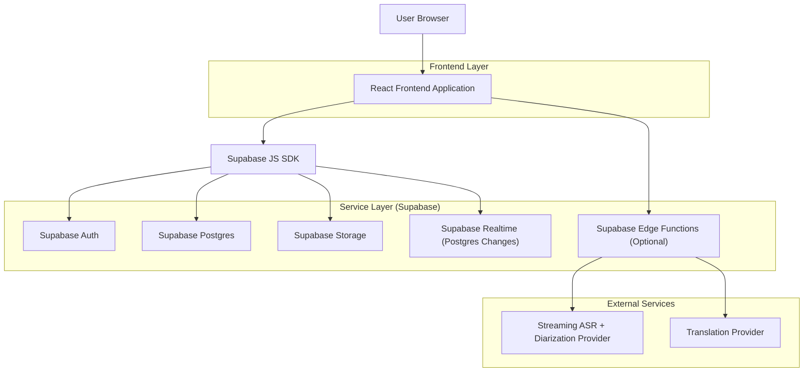
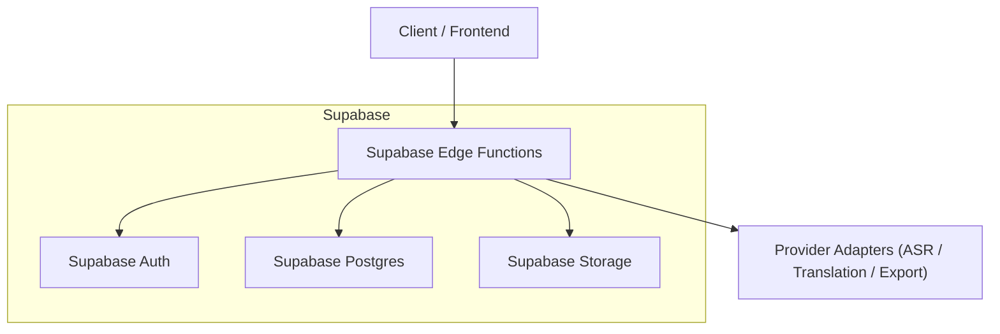
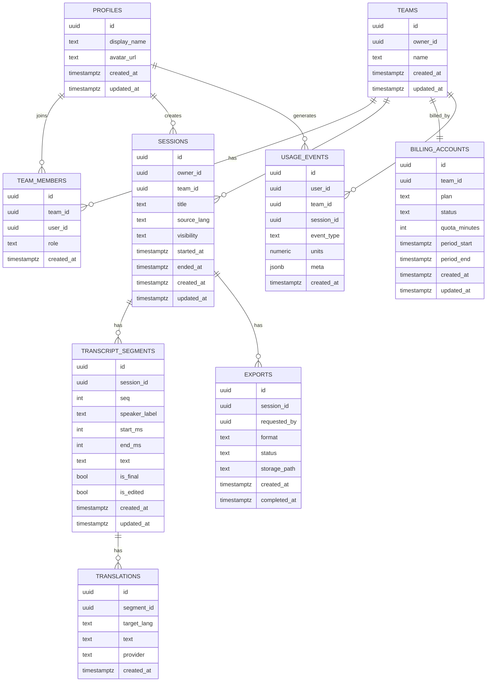

## 1.Architecture design



## 2.Technology Description
- Frontend: React@18 + TypeScript + vite + tailwindcss@3
- Backend: Supabase (Auth + Postgres + Storage + Realtime)
- Server-side (optional, only for secrets / streaming gateways): Supabase Edge Functions
- External APIs (optional): Low-latency streaming ASR w/ diarization; machine translation API

## 3.Route definitions
| Route | Purpose |
|-------|---------|
| / | Home (start/join session, device checks, auth entry) |
| /auth | Sign in / sign up (Supabase Auth) |
| /session/:sessionId | Live session workspace (real-time transcript + translations + editing + export) |
| /s/:shareId | Shared read-only session view + downloads |

## 4.API definitions (If it includes backend services)
If you use Supabase Edge Functions for provider credentials / streaming gateways:

### 4.1 Edge Functions
`POST /functions/v1/session-start`
- Create session + return configuration for ASR/translation.

`POST /functions/v1/audio-token`
- Mint a short-lived provider token (keeps provider secrets off the client).

`POST /functions/v1/export-create`
- Create export job and write output to Supabase Storage.

### 4.2 Shared TypeScript types (core)
```ts
export type TeamRole = "owner" | "admin" | "member";
export type SessionVisibility = "private" | "team" | "unlisted" | "public";
export type ExportFormat = "txt" | "srt" | "vtt" | "json";

export interface Team {
  id: string;
  ownerId: string;
  name: string;
  createdAt: string;
}

export interface Session {
  id: string;
  ownerId: string;
  teamId?: string | null;
  title: string;
  sourceLang: string;
  visibility: SessionVisibility;
  createdAt: string;
  updatedAt: string;
}

export interface TranscriptSegment {
  id: string;
  sessionId: string;
  seq: number;
  speakerLabel: string;
  startMs: number;
  endMs: number;
  text: string;
  isFinal: boolean;
  createdAt: string;
  updatedAt: string;
}

export interface Translation {
  id: string;
  segmentId: string;
  targetLang: string;
  text: string;
  createdAt: string;
}
```

## 5.Server architecture diagram (If it includes backend services)


## 6.Data model(if applicable)

### 6.1 Data model definition


### 6.2 Data Definition Language
Notes:
- Supabase Auth users live in `auth.users`. This schema uses `profiles.id` as a logical reference to `auth.users.id` (no physical FK constraints).
- Enable Supabase Realtime for `transcript_segments` and `translations` so clients can subscribe to Postgres changes.

#### Core tables
```sql
-- Extensions
CREATE EXTENSION IF NOT EXISTS pgcrypto;

-- USERS / PROFILES (one row per auth user)
CREATE TABLE IF NOT EXISTS public.profiles (
  id uuid PRIMARY KEY,
  display_name text NOT NULL DEFAULT '',
  avatar_url text,
  created_at timestamptz NOT NULL DEFAULT now(),
  updated_at timestamptz NOT NULL DEFAULT now()
);

-- TEAMS
CREATE TABLE IF NOT EXISTS public.teams (
  id uuid PRIMARY KEY DEFAULT gen_random_uuid(),
  owner_id uuid NOT NULL,
  name text NOT NULL,
  created_at timestamptz NOT NULL DEFAULT now(),
  updated_at timestamptz NOT NULL DEFAULT now()
);

CREATE TABLE IF NOT EXISTS public.team_members (
  id uuid PRIMARY KEY DEFAULT gen_random_uuid(),
  team_id uuid NOT NULL,
  user_id uuid NOT NULL,
  role text NOT NULL DEFAULT 'member' CHECK (role IN ('owner','admin','member')),
  created_at timestamptz NOT NULL DEFAULT now(),
  UNIQUE (team_id, user_id)
);

-- SESSIONS
CREATE TABLE IF NOT EXISTS public.sessions (
  id uuid PRIMARY KEY DEFAULT gen_random_uuid(),
  owner_id uuid NOT NULL,
  team_id uuid,
  title text NOT NULL DEFAULT '',
  source_lang text NOT NULL,
  visibility text NOT NULL DEFAULT 'private' CHECK (visibility IN ('private','team','unlisted','public')),
  started_at timestamptz,
  ended_at timestamptz,
  created_at timestamptz NOT NULL DEFAULT now(),
  updated_at timestamptz NOT NULL DEFAULT now()
);

-- TRANSCRIPT SEGMENTS
CREATE TABLE IF NOT EXISTS public.transcript_segments (
  id uuid PRIMARY KEY DEFAULT gen_random_uuid(),
  session_id uuid NOT NULL,
  seq integer NOT NULL DEFAULT 0,
  speaker_label text NOT NULL DEFAULT 'Speaker 1',
  start_ms integer NOT NULL,
  end_ms integer NOT NULL,
  text text NOT NULL DEFAULT '',
  is_final boolean NOT NULL DEFAULT false,
  is_edited boolean NOT NULL DEFAULT false,
  created_at timestamptz NOT NULL DEFAULT now(),
  updated_at timestamptz NOT NULL DEFAULT now()
);

-- TRANSLATIONS (normalized per segment/lang)
CREATE TABLE IF NOT EXISTS public.translations (
  id uuid PRIMARY KEY DEFAULT gen_random_uuid(),
  segment_id uuid NOT NULL,
  target_lang text NOT NULL,
  text text NOT NULL DEFAULT '',
  provider text,
  created_at timestamptz NOT NULL DEFAULT now(),
  UNIQUE (segment_id, target_lang)
);

-- EXPORTS (files stored in Supabase Storage)
CREATE TABLE IF NOT EXISTS public.exports (
  id uuid PRIMARY KEY DEFAULT gen_random_uuid(),
  session_id uuid NOT NULL,
  requested_by uuid NOT NULL,
  format text NOT NULL CHECK (format IN ('txt','srt','vtt','json')),
  status text NOT NULL DEFAULT 'queued' CHECK (status IN ('queued','running','completed','failed')),
  storage_path text,
  created_at timestamptz NOT NULL DEFAULT now(),
  completed_at timestamptz
);

-- USAGE / BILLING
CREATE TABLE IF NOT EXISTS public.usage_events (
  id uuid PRIMARY KEY DEFAULT gen_random_uuid(),
  user_id uuid NOT NULL,
  team_id uuid,
  session_id uuid,
  event_type text NOT NULL,
  units numeric NOT NULL DEFAULT 0,
  meta jsonb NOT NULL DEFAULT '{}'::jsonb,
  created_at timestamptz NOT NULL DEFAULT now()
);

CREATE TABLE IF NOT EXISTS public.billing_accounts (
  id uuid PRIMARY KEY DEFAULT gen_random_uuid(),
  team_id uuid NOT NULL UNIQUE,
  plan text NOT NULL DEFAULT 'free',
  status text NOT NULL DEFAULT 'active' CHECK (status IN ('active','past_due','canceled')),
  quota_minutes integer NOT NULL DEFAULT 0,
  period_start timestamptz,
  period_end timestamptz,
  created_at timestamptz NOT NULL DEFAULT now(),
  updated_at timestamptz NOT NULL DEFAULT now()
);
```

#### Indexes
```sql
-- team access
CREATE INDEX IF NOT EXISTS idx_team_members_team_id ON public.team_members(team_id);
CREATE INDEX IF NOT EXISTS idx_team_members_user_id ON public.team_members(user_id);

-- sessions listing
CREATE INDEX IF NOT EXISTS idx_sessions_owner_created_at ON public.sessions(owner_id, created_at DESC);
CREATE INDEX IF NOT EXISTS idx_sessions_team_created_at ON public.sessions(team_id, created_at DESC);

-- segment queries + realtime ordering
CREATE INDEX IF NOT EXISTS idx_segments_session_seq ON public.transcript_segments(session_id, seq);
CREATE INDEX IF NOT EXISTS idx_segments_session_start_ms ON public.transcript_segments(session_id, start_ms);

-- translations lookup
CREATE INDEX IF NOT EXISTS idx_translations_segment_id ON public.translations(segment_id);
CREATE INDEX IF NOT EXISTS idx_translations_target_lang ON public.translations(target_lang);

-- exports
CREATE INDEX IF NOT EXISTS idx_exports_session_created_at ON public.exports(session_id, created_at DESC);

-- usage rollups
CREATE INDEX IF NOT EXISTS idx_usage_user_created_at ON public.usage_events(user_id, created_at DESC);
CREATE INDEX IF NOT EXISTS idx_usage_team_created_at ON public.usage_events(team_id, created_at DESC);
CREATE INDEX IF NOT EXISTS idx_usage_session_id ON public.usage_events(session_id);
```

#### RLS (Row Level Security)
```sql
-- Enable RLS
ALTER TABLE public.profiles ENABLE ROW LEVEL SECURITY;
ALTER TABLE public.teams ENABLE ROW LEVEL SECURITY;
ALTER TABLE public.team_members ENABLE ROW LEVEL SECURITY;
ALTER TABLE public.sessions ENABLE ROW LEVEL SECURITY;
ALTER TABLE public.transcript_segments ENABLE ROW LEVEL SECURITY;
ALTER TABLE public.translations ENABLE ROW LEVEL SECURITY;
ALTER TABLE public.exports ENABLE ROW LEVEL SECURITY;
ALTER TABLE public.usage_events ENABLE ROW LEVEL SECURITY;
ALTER TABLE public.billing_accounts ENABLE ROW LEVEL SECURITY;

-- PROFILES: users can read/update their own profile
CREATE POLICY "profiles_select_own" ON public.profiles
  FOR SELECT TO authenticated
  USING (id = auth.uid());

CREATE POLICY "profiles_update_own" ON public.profiles
  FOR UPDATE TO authenticated
  USING (id = auth.uid())
  WITH CHECK (id = auth.uid());

-- TEAM MEMBERSHIP helper predicate via EXISTS
-- TEAMS: members can read; owner can update/delete; authenticated can create
CREATE POLICY "teams_select_member" ON public.teams
  FOR SELECT TO authenticated
  USING (
    owner_id = auth.uid()
    OR EXISTS (
      SELECT 1 FROM public.team_members tm
      WHERE tm.team_id = teams.id AND tm.user_id = auth.uid()
    )
  );

CREATE POLICY "teams_insert_owner" ON public.teams
  FOR INSERT TO authenticated
  WITH CHECK (owner_id = auth.uid());

CREATE POLICY "teams_update_owner" ON public.teams
  FOR UPDATE TO authenticated
  USING (owner_id = auth.uid())
  WITH CHECK (owner_id = auth.uid());

CREATE POLICY "teams_delete_owner" ON public.teams
  FOR DELETE TO authenticated
  USING (owner_id = auth.uid());

-- TEAM_MEMBERS: members can read; owner/admin can manage
CREATE POLICY "team_members_select_member" ON public.team_members
  FOR SELECT TO authenticated
  USING (
    user_id = auth.uid()
    OR EXISTS (
      SELECT 1 FROM public.team_members tm
      WHERE tm.team_id = team_members.team_id AND tm.user_id = auth.uid()
    )
  );

CREATE POLICY "team_members_insert_owner_admin" ON public.team_members
  FOR INSERT TO authenticated
  WITH CHECK (
    EXISTS (
      SELECT 1 FROM public.team_members tm
      WHERE tm.team_id = team_members.team_id
        AND tm.user_id = auth.uid()
        AND tm.role IN ('owner','admin')
    )
  );

CREATE POLICY "team_members_update_owner_admin" ON public.team_members
  FOR UPDATE TO authenticated
  USING (
    EXISTS (
      SELECT 1 FROM public.team_members tm
      WHERE tm.team_id = team_members.team_id
        AND tm.user_id = auth.uid()
        AND tm.role IN ('owner','admin')
    )
  )
  WITH CHECK (
    EXISTS (
      SELECT 1 FROM public.team_members tm
      WHERE tm.team_id = team_members.team_id
        AND tm.user_id = auth.uid()
        AND tm.role IN ('owner','admin')
    )
  );

CREATE POLICY "team_members_delete_owner_admin" ON public.team_members
  FOR DELETE TO authenticated
  USING (
    EXISTS (
      SELECT 1 FROM public.team_members tm
      WHERE tm.team_id = team_members.team_id
        AND tm.user_id = auth.uid()
        AND tm.role IN ('owner','admin')
    )
  );

-- SESSIONS: owner or team member can read; owner/team admin can write
CREATE POLICY "sessions_select_owner_or_team" ON public.sessions
  FOR SELECT TO authenticated
  USING (
    owner_id = auth.uid()
    OR (
      team_id IS NOT NULL AND EXISTS (
        SELECT 1 FROM public.team_members tm
        WHERE tm.team_id = sessions.team_id AND tm.user_id = auth.uid()
      )
    )
  );

CREATE POLICY "sessions_insert_owner" ON public.sessions
  FOR INSERT TO authenticated
  WITH CHECK (owner_id = auth.uid());

CREATE POLICY "sessions_update_owner_or_team_admin" ON public.sessions
  FOR UPDATE TO authenticated
  USING (
    owner_id = auth.uid()
    OR (
      team_id IS NOT NULL AND EXISTS (
        SELECT 1 FROM public.team_members tm
        WHERE tm.team_id = sessions.team_id
          AND tm.user_id = auth.uid()
          AND tm.role IN ('owner','admin')
      )
    )
  )
  WITH CHECK (
    owner_id = auth.uid()
    OR (
      team_id IS NOT NULL AND EXISTS (
        SELECT 1 FROM public.team_members tm
        WHERE tm.team_id = sessions.team_id
          AND tm.user_id = auth.uid()
          AND tm.role IN ('owner','admin')
      )
    )
  );

-- TRANSCRIPT_SEGMENTS: readable/writable if you can access the parent session
CREATE POLICY "segments_select_via_session" ON public.transcript_segments
  FOR SELECT TO authenticated
  USING (
    EXISTS (
      SELECT 1 FROM public.sessions s
      WHERE s.id = transcript_segments.session_id
        AND (
          s.owner_id = auth.uid()
          OR (s.team_id IS NOT NULL AND EXISTS (
            SELECT 1 FROM public.team_members tm
            WHERE tm.team_id = s.team_id AND tm.user_id = auth.uid()
          ))
        )
    )
  );

CREATE POLICY "segments_write_via_session" ON public.transcript_segments
  FOR ALL TO authenticated
  USING (
    EXISTS (
      SELECT 1 FROM public.sessions s
      WHERE s.id = transcript_segments.session_id
        AND (
          s.owner_id = auth.uid()
          OR (s.team_id IS NOT NULL AND EXISTS (
            SELECT 1 FROM public.team_members tm
            WHERE tm.team_id = s.team_id
              AND tm.user_id = auth.uid()
              AND tm.role IN ('owner','admin','member')
          ))
        )
    )
  )
  WITH CHECK (
    EXISTS (
      SELECT 1 FROM public.sessions s
      WHERE s.id = transcript_segments.session_id
        AND (
          s.owner_id = auth.uid()
          OR (s.team_id IS NOT NULL AND EXISTS (
            SELECT 1 FROM public.team_members tm
            WHERE tm.team_id = s.team_id
              AND tm.user_id = auth.uid()
              AND tm.role IN ('owner','admin','member')
          ))
        )
    )
  );

-- TRANSLATIONS: readable/writable if you can access the parent segment's session
CREATE POLICY "translations_select_via_segment" ON public.translations
  FOR SELECT TO authenticated
  USING (
    EXISTS (
      SELECT 1
      FROM public.transcript_segments seg
      JOIN public.sessions s ON s.id = seg.session_id
      WHERE seg.id = translations.segment_id
        AND (
          s.owner_id = auth.uid()
          OR (s.team_id IS NOT NULL AND EXISTS (
            SELECT 1 FROM public.team_members tm
            WHERE tm.team_id = s.team_id AND tm.user_id = auth.uid()
          ))
        )
    )
  );

CREATE POLICY "translations_write_via_segment" ON public.translations
  FOR ALL TO authenticated
  USING (
    EXISTS (
      SELECT 1
      FROM public.transcript_segments seg
      JOIN public.sessions s ON s.id = seg.session_id
      WHERE seg.id = translations.segment_id
        AND (
          s.owner_id = auth.uid()
          OR (s.team_id IS NOT NULL AND EXISTS (
            SELECT 1 FROM public.team_members tm
            WHERE tm.team_id = s.team_id AND tm.user_id = auth.uid()
          ))
        )
    )
  )
  WITH CHECK (
    EXISTS (
      SELECT 1
      FROM public.transcript_segments seg
      JOIN public.sessions s ON s.id = seg.session_id
      WHERE seg.id = translations.segment_id
        AND (
          s.owner_id = auth.uid()
          OR (s.team_id IS NOT NULL AND EXISTS (
            SELECT 1 FROM public.team_members tm
            WHERE tm.team_id = s.team_id AND tm.user_id = auth.uid()
          ))
        )
    )
  );

-- EXPORTS: readable if you can access session; writable if you can access session
CREATE POLICY "exports_select_via_session" ON public.exports
  FOR SELECT TO authenticated
  USING (
    EXISTS (
      SELECT 1 FROM public.sessions s
      WHERE s.id = exports.session_id
        AND (
          s.owner_id = auth.uid()
          OR (s.team_id IS NOT NULL AND EXISTS (
            SELECT 1 FROM public.team_members tm
            WHERE tm.team_id = s.team_id AND tm.user_id = auth.uid()
          ))
        )
    )
  );

CREATE POLICY "exports_write_via_session" ON public.exports
  FOR ALL TO authenticated
  USING (
    EXISTS (
      SELECT 1 FROM public.sessions s
      WHERE s.id = exports.session_id
        AND (
          s.owner_id = auth.uid()
          OR (s.team_id IS NOT NULL AND EXISTS (
            SELECT 1 FROM public.team_members tm
            WHERE tm.team_id = s.team_id AND tm.user_id = auth.uid()
          ))
        )
    )
  )
  WITH CHECK (
    EXISTS (
      SELECT 1 FROM public.sessions s
      WHERE s.id = exports.session_id
        AND (
          s.owner_id = auth.uid()
          OR (s.team_id IS NOT NULL AND EXISTS (
            SELECT 1 FROM public.team_members tm
            WHERE tm.team_id = s.team_id AND tm.user_id = auth.uid()
          ))
        )
    )
  );

-- USAGE_EVENTS: allow inserting own events; reading limited to team admins/owners (and self)
CREATE POLICY "usage_insert_self" ON public.usage_events
  FOR INSERT TO authenticated
  WITH CHECK (user_id = auth.uid());

CREATE POLICY "usage_select_self_or_team_admin" ON public.usage_events
  FOR SELECT TO authenticated
  USING (
    user_id = auth.uid()
    OR (
      team_id IS NOT NULL AND EXISTS (
        SELECT 1 FROM public.team_members tm
        WHERE tm.team_id = usage_events.team_id
          AND tm.user_id = auth.uid()
          AND tm.role IN ('owner','admin')
      )
    )
  );

-- BILLING_ACCOUNTS: readable/writable by team owner/admin
CREATE POLICY "billing_select_team_admin" ON public.billing_accounts
  FOR SELECT TO authenticated
  USING (
    EXISTS (
      SELECT 1 FROM public.team_members tm
      WHERE tm.team_id = billing_accounts.team_id
        AND tm.user_id = auth.uid()
        AND tm.role IN ('owner','admin')
    )
  );

CREATE POLICY "billing_write_team_owner" ON public.billing_accounts
  FOR ALL TO authenticated
  USING (
    EXISTS (
      SELECT 1 FROM public.team_members tm
      WHERE tm.team_id = billing_accounts.team_id
        AND tm.user_id = auth.uid()
        AND tm.role IN ('owner')
    )
  )
  WITH CHECK (
    EXISTS (
      SELECT 1 FROM public.team_members tm
      WHERE tm.team_id = billing_accounts.team_id
        AND tm.user_id = auth.uid()
        AND tm.role IN ('owner')
    )
  );
```

#### Grants (Supabase guideline baseline)
```sql
GRANT SELECT ON public.profiles, public.teams, public.team_members, public.sessions, public.transcript_segments, public.translations, public.exports, public.usage_events, public.billing_accounts TO anon;
GRANT ALL PRIVILEGES ON public.profiles, public.teams, public.team_members, public.sessions, public.transcript_segments, public.translations, public.exports, public.usage_events, public.billing_accounts TO authenticated;
```

#### Storage (buckets + recommended path convention)
Recommended buckets:
- `session-audio` (optional if you persist audio)
- `session-exports`

Recommended object key convention (enables simple Storage RLS):
- Audio: `team/{team_id}/session/{session_id}/audio/{file}` or `user/{user_id}/session/{session_id}/audio/{file}`
- Exports: `team/{team_id}/session/{session_id}/exports/{export_id}.{ext}`

Example Storage RLS (simplified; adjust based on your key convention):
```sql
-- Allow authenticated reads in exports bucket
CREATE POLICY "storage_exports_read_auth" ON storage.objects
  FOR SELECT TO authenticated
  USING (bucket_id = 'session-exports');

-- Allow authenticated writes in exports bucket
CREATE POLICY "storage_exports_write_auth" ON storage.objects
  FOR INSERT TO authenticated
  WITH CHECK (bucket_id = 'session-exports');
```

#### Realtime
Enable Realtime replication for:
- `public.transcript_segments`
- `public.translations`

Client subscribes using `postgres_changes` filters on `session_id` (segments) and `segment_id` (translations).