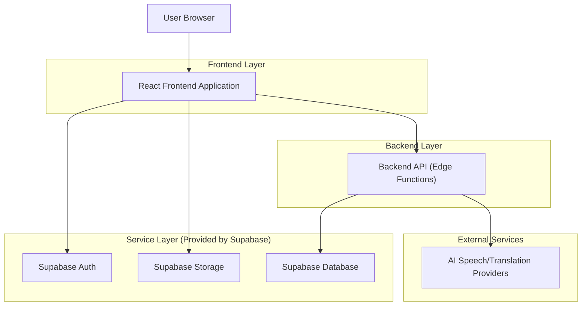
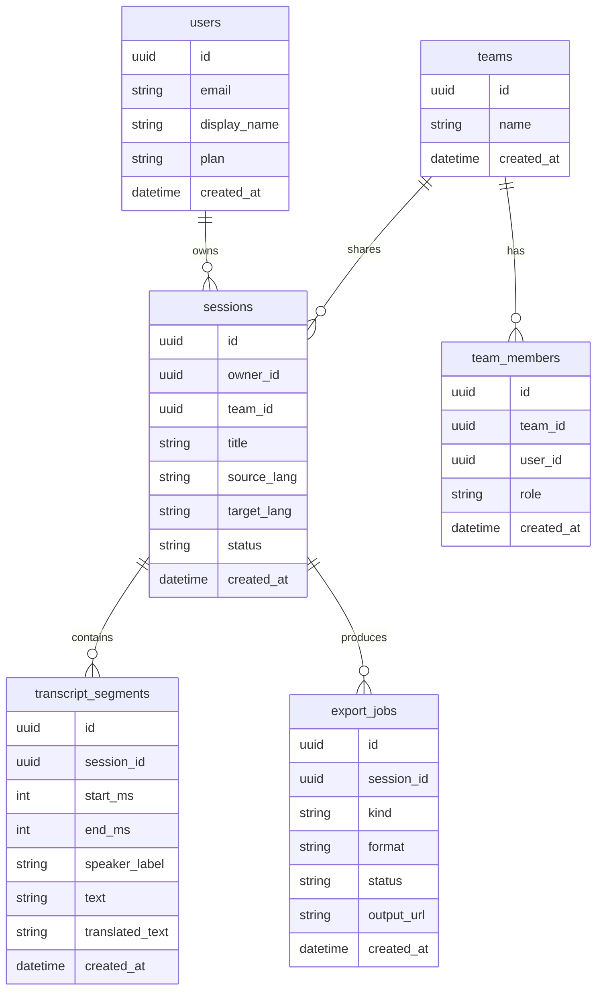

## 1.Architecture design


## 2.Technology Description
- Frontend: React@18 + TypeScript + vite + tailwindcss@3
- Backend: Supabase (Auth, Postgres, Storage) + Supabase Edge Functions (server-side API)

## 3.Route definitions
| Route | Purpose |
|---|---|
| /live | Main live session experience (start/capture, live captions/translation, sharing) |
| /dashboard | Saved sessions library and quick actions |
| /session/:id | Session editor (transcript/captions/voice/export) |
| /account | Plan/usage, billing, integrations, team management |
| /login | Authentication and upgrade gating |

## 4.API definitions (If it includes backend services)
### 4.1 Core types (shared)
```ts
type SessionId = string;

type SessionStatus = "live" | "saved" | "processing" | "exported";

type Session = {
  id: SessionId;
  ownerId: string;
  title: string;
  sourceLang: string; // e.g. "en"
  targetLang?: string; // optional for transcription-only
  status: SessionStatus;
  createdAt: string;
};

type TranscriptSegment = {
  id: string;
  sessionId: SessionId;
  startMs: number;
  endMs: number;
  speakerLabel?: string;
  text: string;
  translatedText?: string;
  createdAt: string;
};

type ExportJob = {
  id: string;
  sessionId: SessionId;
  kind: "transcript" | "subtitles" | "voiceover";
  format: string; // e.g. "txt" | "srt" | "vtt" | "mp3"
  status: "queued" | "running" | "done" | "failed";
  outputUrl?: string;
  createdAt: string;
};
```

### 4.2 Core API (Edge Functions)
Create session
```
POST /api/sessions
```
Append segment batch (for live)
```
POST /api/sessions/{id}/segments:append
```
Finalize session
```
POST /api/sessions/{id}:finalize
```
Create export job
```
POST /api/sessions/{id}/exports
```

## 6.Data model(if applicable)
### 6.1 Data model definition


### 6.2 Data Definition Language
User profiles (profiles)
```
CREATE TABLE profiles (
  id UUID PRIMARY KEY,
  email TEXT UNIQUE NOT NULL,
  display_name TEXT,
  plan TEXT DEFAULT 'free',
  created_at TIMESTAMPTZ DEFAULT NOW()
);
GRANT SELECT ON profiles TO anon;
GRANT ALL PRIVILEGES ON profiles TO authenticated;
```
Sessions (sessions)
```
CREATE TABLE sessions (
  id UUID PRIMARY KEY DEFAULT gen_random_uuid(),
  owner_id UUID NOT NULL,
  team_id UUID,
  title TEXT NOT NULL,
  source_lang TEXT NOT NULL,
  target_lang TEXT,
  status TEXT NOT NULL DEFAULT 'saved',
  created_at TIMESTAMPTZ DEFAULT NOW()
);
CREATE INDEX idx_sessions_owner_id_created_at ON sessions(owner_id, created_at DESC);
GRANT SELECT ON sessions TO anon;
GRANT ALL PRIVILEGES ON sessions TO authenticated;
```
Transcript segments (transcript_segments)
```
CREATE TABLE transcript_segments (
  id UUID PRIMARY KEY DEFAULT gen_random_uuid(),
  session_id UUID NOT NULL,
  start_ms INT NOT NULL,
  end_ms INT NOT NULL,
  speaker_label TEXT,
  text TEXT NOT NULL,
  translated_text TEXT,
  created_at TIMESTAMPTZ DEFAULT NOW()
);
CREATE INDEX idx_segments_session_id_start_ms ON transcript_segments(session_id, start_ms);
GRANT SELECT ON transcript_segments TO anon;
GRANT ALL PRIVILEGES ON transcript_segments TO authenticated;
```
Export jobs (export_jobs)
```
CREATE TABLE export_jobs (
  id UUID PRIMARY KEY DEFAULT gen_random_uuid(),
  session_id UUID NOT NULL,
  kind TEXT NOT NULL,
  format TEXT NOT NULL,
  status TEXT NOT NULL DEFAULT 'queued',
  output_url TEXT,
  created_at TIMESTAMPTZ DEFAULT NOW()
);
CREATE INDEX idx_export_jobs_session_id_created_at ON export_jobs(session_id, created_at DESC);
GRANT SELECT ON export_jobs TO anon;
GRANT ALL PRIVILEGES ON export_jobs TO authenticated;
```
